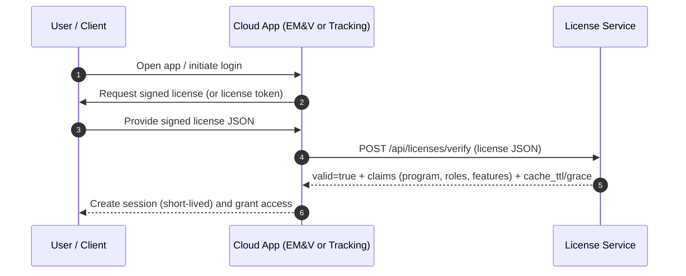

# Cloud Program Login Flow (EM&V and Synerex Tracking)

This platform treats the **signed Synerex license** as the primary authorization artifact.
Both cloud programs (EM&V and Tracking) authorize access by validating the license
against the License Service.

## High-level sequence

## Enforcement rules

### EM&V cloud app
- Require `program.program_id == "emv"`
- Enforce tier (Baseline / Pro / Enterprise) via entitlements:
  - `entitlements.plan`
  - `entitlements.features`
  - `entitlements.limits`

### Tracking cloud app
- Require `program.program_id == "tracking"`
- Enforce tier (Basic / Pro / Enterprise)
- Enforce **baseline lineage** (baseline_id + snapshot_id) as part of license bindings:
  - `bindings.baseline_lineage.baseline_id`
  - `bindings.baseline_lineage.snapshot_id`

## Recommended session pattern (cloud apps)

To avoid sending the full license on every request, the cloud app should:
1. verify the license online
2. mint a **short-lived session token** (e.g., JWT; 5–15 minutes)
3. include claims such as:
   - `license_id`
   - `program_id`
   - `org_id`
   - `roles`
   - `features`
   - `verified_at`
4. refresh by re-verifying the license when the session token expires

This keeps the License Service as the **single source of truth**, while the app remains responsive.

## Caching guidance
Honor `cache_ttl_sec` from `/api/licenses/verify` for positive decisions. If the License Service
is temporarily unreachable, honor `grace_seconds` to allow minimal continuity (Tracking only),
then require re-validation.
